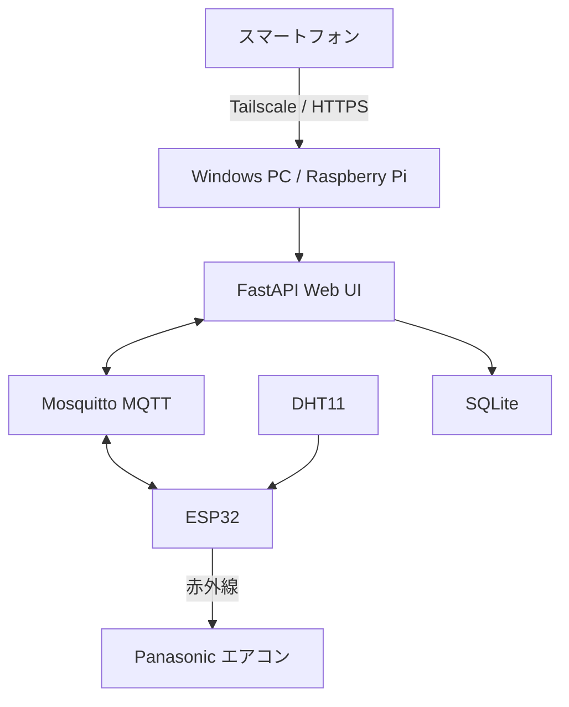

# HomeLab

ESP32と自宅サーバーを利用して、家電制御や室内環境の記録を行うHome IoTプロジェクトです。

現在は、Panasonic製エアコンの赤外線制御、DHT11による温湿度測定、Webリモコン、SQLiteへの測定履歴保存に対応しています。

## 主な機能

- ESP32からPanasonicエアコンへ赤外線信号を送信
- Webブラウザからエアコンを操作
- 冷房・暖房・除湿・送風・自動運転
- 16〜30℃の温度設定
- 風量・上下風向の変更
- 静音運転・パワフル運転
- DHT11による室温・湿度測定
- Wi-Fi電波強度（RSSI）の取得
- SQLiteへの温湿度履歴保存
- 温度・湿度の履歴グラフ表示
- MQTTによるESP32とサーバー間の通信
- Tailscale経由での外出先からのアクセス

## システム構成



現在はWindows PC上のWSL2とDockerでサーバーを動かしています。今後、Raspberry Pi 5へ移行する予定です。

## ディレクトリ構成

```text
HomeLab/
├── compose.yaml
├── firmware/
│   └── esp32_aircon/
│       ├── esp32_aircon.ino
│       └── secrets.example.h
├── mosquitto/
│   └── config/
│       ├── acl
│       └── mosquitto.conf
└── server/
    ├── .env.example
    ├── Dockerfile
    ├── requirements.txt
    └── app/
        ├── main.py
        └── static/
            └── index.html
```

## 使用技術

### ESP32

- Arduino
- ArduinoJson
- DHT sensor library
- IRremoteESP8266
- PubSubClient
- WiFi
- Panasonic AC（JKEモデル）

### サーバー

- Python
- FastAPI
- Uvicorn
- Eclipse Mosquitto
- SQLite
- Docker Compose
- Tailscale

## ESP32の配線

| 部品 | ESP32 |
|---|---:|
| DHT11 DATA | GPIO 25 |
| 赤外線LED制御 | GPIO 26 |
| DHT11 VCC | 3.3V |
| DHT11 GND | GND |

赤外線LEDはESP32のGPIOから直接駆動せず、トランジスタと電流制限抵抗を使用します。

## ESP32のセットアップ

### 1. Arduinoライブラリ

Arduino IDEのライブラリマネージャーから、以下をインストールします。

- ArduinoJson
- DHT sensor library
- Adafruit Unified Sensor
- IRremoteESP8266
- PubSubClient

### 2. 設定ファイルの作成

`secrets.example.h` をコピーして、`secrets.h` を作成します。

```powershell
Copy-Item `
  .\firmware\esp32_aircon\secrets.example.h `
  .\firmware\esp32_aircon\secrets.h
```

`secrets.h` にWi-FiとMQTTの接続情報を設定します。

```cpp
#pragma once

#define WIFI_SSID "YOUR_WIFI_SSID"
#define WIFI_PASSWORD "YOUR_WIFI_PASSWORD"

#define MQTT_HOST "192.168.1.100"
#define MQTT_PORT 1883
#define MQTT_USERNAME "esp32"
#define MQTT_PASSWORD "YOUR_MQTT_PASSWORD"
```

`secrets.h` はGit管理から除外されています。

### 3. ESP32への書き込み

Arduino IDEで次のファイルを開き、ESP32へ書き込みます。

```text
firmware/esp32_aircon/esp32_aircon.ino
```

## サーバーのセットアップ

### 必要環境

- Git
- Docker
- Docker Compose

### 1. リポジトリの取得

```powershell
git clone https://github.com/soyaOHNO/HomeLab.git
cd HomeLab
```

### 2. サーバー設定の作成

```powershell
Copy-Item .\server\.env.example .\server\.env
```

`server/.env` を編集します。

```dotenv
MQTT_HOST=mqtt
MQTT_PORT=1883
MQTT_USERNAME=server
MQTT_PASSWORD=YOUR_MQTT_PASSWORD
```

### 3. MQTTパスワードの作成

最初にESP32用ユーザーを作成します。

```powershell
docker compose run --rm --user root mqtt `
  mosquitto_passwd -c /mosquitto/secrets/passwd esp32
```

続いてサーバー用ユーザーを追加します。

```powershell
docker compose run --rm --user root mqtt `
  mosquitto_passwd /mosquitto/secrets/passwd server
```

ESP32用パスワードは `secrets.h`、サーバー用パスワードは `server/.env` に設定します。

ファイルの所有者と権限を修正します。

```powershell
docker compose run --rm --user root mqtt `
  sh -c "chown mosquitto:mosquitto /mosquitto/secrets/passwd && chmod 0700 /mosquitto/secrets/passwd"
```

### 4. コンテナの起動

```powershell
docker compose up -d --build
```

状態を確認します。

```powershell
docker compose ps
docker compose logs --tail 50 mqtt
docker compose logs --tail 50 server
```

## Webリモコン

ローカルPCから次のURLを開きます。

```text
http://127.0.0.1:8000
```

外出先から利用する場合は、ホストPCまたはRaspberry PiにTailscaleを導入し、Tailscale Serveから `http://127.0.0.1:8000` へプロキシします。

FastAPIはホストのループバックアドレスにのみ公開されます。

## API

| Method | Path | 内容 |
|---|---|---|
| `GET` | `/health` | API・MQTT接続状態 |
| `GET` | `/api/aircon` | エアコン・センサーの現在状態 |
| `POST` | `/api/aircon` | エアコン操作 |
| `GET` | `/api/aircon/history?hours=24` | 温湿度履歴 |

### 操作例

```powershell
$body = @{
  power = $true
  mode = "cool"
  temperature = 24
  fan = "auto"
  swing_vertical = "auto"
  quiet = $false
  powerful = $false
} | ConvertTo-Json

Invoke-RestMethod `
  -Method Post `
  -Uri "http://127.0.0.1:8000/api/aircon" `
  -ContentType "application/json" `
  -Body $body
```

### 設定値

| 項目 | 設定可能な値 |
|---|---|
| `power` | `true`, `false` |
| `mode` | `auto`, `cool`, `dry`, `heat`, `fan` |
| `temperature` | `16`〜`30` |
| `fan` | `auto`, `min`, `low`, `medium`, `high`, `max` |
| `swing_vertical` | `auto`, `highest`, `high`, `middle`, `low`, `lowest` |
| `quiet` | `true`, `false` |
| `powerful` | `true`, `false` |

## MQTTトピック

| トピック | 方向 | 内容 |
|---|---|---|
| `home/aircon/aircon-01/set` | Server → ESP32 | エアコン操作 |
| `home/aircon/aircon-01/state` | ESP32 → Server | エアコン設定状態 |
| `home/aircon/aircon-01/telemetry` | ESP32 → Server | 温度・湿度・RSSI |
| `home/aircon/aircon-01/availability` | ESP32 → Server | `online` / `offline` |

MosquittoのACLにより、ESP32とサーバーには必要なトピックだけの読み書きを許可しています。

## 温湿度データ

温湿度データはSQLiteへ保存されます。

```text
/data/home-iot.db
```

Dockerの `app-data` ボリュームに格納されるため、コンテナを再作成してもデータは保持されます。

- ESP32の測定間隔：3秒
- SQLiteへの保存間隔：30秒
- 保存期間：90日
- 6時間以内：30秒単位で取得
- 48時間以内：5分単位で集約
- 48時間超：30分単位で集約
- 履歴APIの指定範囲：1〜720時間

## セキュリティ

次のファイルには秘密情報が含まれるため、Gitへコミットしません。

```text
firmware/esp32_aircon/secrets.h
server/.env
mosquitto/config/passwd
```

MQTTの1883番ポートはTLSを使用していないため、インターネットへ直接公開しないでください。LAN内通信に限定し、外部からのWebリモコン利用にはTailscaleを使用します。

## 今後の予定

- Raspberry Pi 5へのサーバー移行
- SQLiteデータのバックアップ
- Wake-on-LANによるデスクトップPC起動
- コーヒー焙煎プロファイルの取得・記録
- スマートロック連携
- センサーおよび家電デバイスの追加